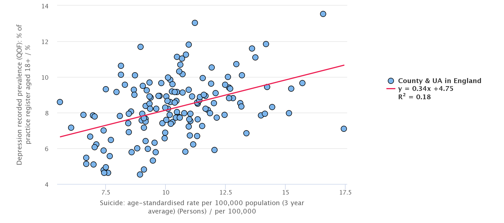

```{r setup, include=FALSE}
knitr::opts_chunk$set(echo = FALSE, cache = TRUE, warning = FALSE, digits = 2 )
# library(doMC)
# # parallel for vtreat
# ncores <- parallel::detectCores()
# parallelCluster <- parallel::makeCluster(ncores)
# # parallel for caret
# registerDoMC(cores=ncores)

```

# Introduction

## Suicide and suicide prevention

Suicide rates in men particularly have been increasing in recent years, and suicide prevention is a significant public health issue. As part of efforts to help tackle suicide, Public Health England published a [Suicide Prevention atlas](https://healthierlives.phe.org.uk/topic/suicide-prevention), and a [Fingertips suicide prevention profile](https://fingertips.phe.org.uk/profile-group/mental-health/profile/suicide/data#page/0). These resources present a set of summary statistics showing trends and variation across England in suicide rates alongside a range of predictors and risk factors. PHE also published an accompanying [manual for suicide prevention](https://www.gov.uk/government/uploads/system/uploads/attachment_data/file/585411/PHE_local_suicide_prevention_planning_practice_resource.pdf).

The guidance recommends a focus on 8 areas:

1. Reducing risks in men tackling issues like debt, social isolation and drugs and alcohol
2. Preventing and responding to self-harm
3. Tackling mental health issues in children and young people
4. Treating depression in primary care
5. Safer acute mental health care
6. Targetting high frequency locations
7. Reducing isolation through community support
8. Bereavement support

The data are presented in a number of ways.

* univariate analysis - i.e. single indicators showing variation, comparison with benchmarks (national rates or similar areas)
* as spine charts - which give an at a glance summary of indicator values across all the indicators
* comparison between indicators. The Fingertips profile enables users to draw scatter plots (see example below) which summarise the relationships between indicators. In this case it shows that although suicide rates tend to be higher in areas with higher rates of depression, the relationship is weak.


The suicide prevention guidance also includes a section on using data including surveillance systems, audit and utilising aggregate data (like the profiles) to aid understanding of the contributors to local suicide rates and build local monitoring systems.

### Predictive modelling

One additional approach is the use of *predictive analytics* - this is core of supervised machine learning^[In machine learning, supervision refers to data where we already know the values we are trying to predict]. This is multi-variate analysis - using all the data to:

1. Build a statistical model which has the best predictive value for suicide rates
2. Aid understanding of which risks or explanatory factors are most important in explaining the variation in suicide rates

This kind of analysis can help us better understand the extent to which we might be able to reduce suicide rates, and explain the variation.

The most widely used algorithm is *multiple linear regression*, but other algorithms such as penalised regression modelling, random forests and support vector machines are increasingly being used as they sometimes have more predictive power, and can filter out the most important variables. 

In this analysis we have tried to address the question - "do the indicators in the suicide prevention profile, predict suicide rates?"


## Methods

There are number of steps to perform the analysis:

* Obtain and clean the data (missing values, variable names)
* Select outcome measures
* Construct a testing script to perform the modelling

The code for obtaining the data, cleaning, and running the algorithms is available [here](insert link).

### Data
We downloaded the data for the suicide prevention profile from
[Fingertips](https://fingertips.phe.org.uk) via its *Application Programming Interface* (API) which can be readily accessed using  *R* statistical programming software using the `fingertipsR` package.


### Analysis

All analysis was conducted with R Software using the Classfication and Regression Training (`caret`) package. This contains all the tools to split data into training and test sets, run a range of predictive algorithms, extract predictions and important variables, and assess model accuracy.

For the purpose of this analysis, we split the data into 2 parts at random - a training set and test set. The training set consists of 70% of the data and is used to assess the various modelling algorithms and identify those with the best predictive value. These are then applied to the test data to see how well they perform on "unseen" data.

The algorithms we tested for this analysis are:

* linear regression
* glmnet
* random forest
* radialSVM
* lasso regression


```{r libraries and loading script, warning=FALSE, message=FALSE}
library(fingertipsR)
library(tidyverse)
library(ggjoy)
library(WVPlots)
library(stringr)
library(caret)
library(caretEnsemble)
library(govstyle)

source("scripts/get_sui_data.R")
```

```{r download, cache = TRUE}

analysis_final <- analysis_final %>%
  janitor::clean_names()


```

Downloading the Suicide prevention profile dataset yields a dataframe with `r nrow(dataset)` rows and `r ncol(dataset)` variables. There are `r length(unique(dataset$IndicatorID))` indicators in the dataset.

### Creating a modelling dataset
For the analysis we need to use the most recent data for each variable. Because of the very long variable names used in Fingertips some simplification is needed.

## Exploratory analysis

### Variation in suicide rates

Men have much higher suicide rates than women and there is more variation in rates between local authorities.

```{r variation, fig.cap = "Variation in male and female suicide rates by time period", message= FALSE, warning=FALSE}

library(viridis)

dataset %>%
  filter(IndicatorID == 41001, !Sex == "Persons") %>%
  select(AreaName, Timeperiod, TimeperiodSortable, Value, Sex) %>%
  ggplot(aes(x = Value, y = reorder(Timeperiod, -TimeperiodSortable), fill = ..x..)) +
  geom_joy_gradient(rel_min_height = .05, scale = 2, gradient_lwd = .5) + 
  theme_joy(font_size = 10) +
  facet_wrap(~Sex, scales = "free") +
  scale_fill_viridis(name = "", direction = -1, option = "C")+
  scale_x_continuous(expand = c(0.01, 0)) +  
  labs(x = "Suicide rate", 
       y = "") 


```


```{r, fig.cap = "Trends in national suicide rates by sex"}

dataset %>%
  filter(IndicatorID == 41001) %>%
  select(AreaName, Timeperiod, TimeperiodSortable, Value, Sex, IndicatorName) %>%
  filter(AreaName == "England") %>%
  ggplot(aes(Timeperiod, Value, color = Sex)) +
  geom_line(aes(group = Sex)) + 
  geom_point() +
  facet_wrap(~IndicatorName) +
  labs(y = "Suicide rate", 
       x = "")

```

## Preparing the data

Missing data is a limitation of the dataset. Data is mainly missing due to small number suppression required for disclosure control purposes to release the values into the public domain. To prepare the data for analysis, in general missing data needs to be removed or imputed. For this analysis we have

* Excluded variables with > 10% missing values
* Excluded outcome data with no value
* Imputed any remaining missing values in predictor variables to the mean value


### Looking at variables

#### Summary statistics

```{r}
options(digits = 3)

summary_stats <- analysis_final %>%
  select(suicide_rate) %>%
  summarise(min = min(suicide_rate), 
            max = max(suicide_rate), 
            mean = mean(suicide_rate), 
            sd = sd(suicide_rate))
  
summary_stats %>%
    knitr::kable(caption = "Summary statistics for suicide rates")

```

Suicide rates vary between `r summary_stats$min` and `r summary_stats$max` per 100,000 with a mean rate of `r summary_stats$mean`.


We can review the relationship between the variables in our analytical data set. This shows that the area suicide rate is not very strongly correlated with any of the variables in the profile and suggests that a model based on these variables may lack predictive power. There are clusters of associated variables, for example related to alcohol.


```{r, fig.cap="Correlation matrix of analysis variables", fig.height=6, fig.width=6}

cor <- cor(analysis_final)
corrplot::corrplot(cor, tl.cex = .7, tl.col = "black", order = "hclust", number.cex = .4, type = "lower", method = "square")

corrr <- analysis_final %>%
  corrr::correlate()


```

The next step is to build a model to try and predict suicide rates. 

### Simple linear regression

```{r}
fmla <- suicide_rate ~ .

mod_lm <- lm(fmla, data = analysis_final)

lm_tidy <- broom::tidy(mod_lm) %>%
  filter(p.value < 0.05)

lm_analysis <- broom::augment(mod_lm, analysis_final)

rsq <- mod_lm %>%
  broom::glance() %>%
  select(r.squared)

lm_rmse <- lm_analysis %>%
  summarise(rmse = sqrt(mean(.resid^2)))
```

Model accuracy can be assessed in a number of ways:

1. The R squared value which is a measure of the proportion the variation in the daa explained by the model. The nearer this is to 1 the better the model.
2. Root mean squared error (RMSE) which measures how far on average, the model predictions are from the actual data. The nearer this is to 0 the more accurate the model.

For the simple regression model these are `r rsq$r.squared` and `r lm_rmse$rmse` respectively. The RMSE suggests that on average, the model will predict suicide rates to wth 1.36 per 100,000 - which is a relative error of 13%.

From this model the variables which are most predictive of suicide rates are `r lm_tidy$term`.

Finally we can plot our predictions against the actual values.

```{r, message=FALSE, warning=FALSE}

lm_analysis %>%
  ggplot(aes(suicide_rate, .fitted)) +
  geom_point() +
  geom_smooth(method = "lm") +
  theme_gov()


```


## Machine learning

We can apply machine learning algorithms to see if we can improve the predictive value of our models.

We'll split the data into training and test sets using random sampling and we'll do this 100 times over. This process is known as cross validation. It optimises the model and allows us to choose the most accurate model for further prediction. Of the algorithms included in this analysis, glmnet and random forest have the lowest RMSE and highest R squared - which admittedly is quite low at 0.5.

```{r, fig.cap="Summary statistics for model accuracy", message=FALSE, warning=FALSE, cache=TRUE}

library(caretEnsemble)
seed <- 1234


index <- createDataPartition(analysis_final$suicide_rate, p = 0.7, list = FALSE)

train.mod <- analysis_final[index, ]
test.mod <- analysis_final[-index, ]


broom::glance(t.test(train.mod$suicide_rate, test.mod$suicide_rate)) ## no sig diff between test and train

control <- trainControl(method="repeatedcv", number=10, repeats=10, savePredictions=TRUE, classProbs=TRUE)

## Set model list
algorithmList <- c( 'glm', 'glmnet', 'lasso',  'rf', 'svmRadial')

set.seed(seed)


models <- caretList(fmla, data=train.mod, trControl=control, methodList=algorithmList)

results <- resamples(models)

## results


## plot results
dotplot(results)

```

### GLMNET

```{r, glmnet, fig.cap= "Variable importance based on best glmnet model"}
enet.mod <- train(fmla, data=train.mod, method="glmnet", tuneLength=5, trControl=trainControl(method="cv", number=10, repeats = 3, savePredictions = TRUE))
```


```{r, fig.cap= "Predictions vs suicide rates in test data"}

predictions <- predict(enet.mod, newdata = test.mod)

rmse <- RMSE(predictions, test.mod$suicide_rate)
r2 <- R2(predictions, test.mod$suicide_rate)
test.mod$predictions <- predictions

test.mod %>%
  ggplot(aes(predictions, suicide_rate)) +
  geom_point() +
  geom_smooth(method = "lm")


```

The most accurate model appears to be glmnet algorithm with a RMSE of `r rmse[1]` and and R squared of `r r2[1]`. From this we can extract a metric known as variable importance. This tells us which variables are the most predictive (based on their appearance as a predictor in each cross-validation run). This shows that the most important predictors (of the variables in prevention profile), are:

* prevalence of severe mental illness
* prevalence of alcohol treatment in people over 18
* homelessness
* living alone (older people and adults)
* marital break up
* children in the youth justice system
* unemployment rates
* depression

This is illustrated in figure:


```{r, fig.cap="Variable importance"}
modvimp <- varImp(enet.mod, scale = FALSE)
plot(modvimp) 
```


## Discussion

When people think of machine learning they often think of 'big data', but although our data is not big in terms of size it is often complex and multivariate, and machine learning tools can equally well be applied to these datasets. In this example we have applied a machine learning pipeline to the suicide prevention profile which shows that although none of the models are very highly predictive,  glmnet produces the most accurate solution, and we can still build a model which can predict suicide rates to an accuracy of 1.5 per 100,000 (~ 12% error rate). This may be useful, but only half of the variation is explained by variables in the prevention profiles, and may not be thought sufficiently predictive to develop further. 

Perhaps of more interest is the variable importance which seems to have face validity in terms of identified predictors of population suicide rates - some of which are amenable to intervention.

It may well be that there are additional data items in Fingertips database which can improve the predictive value of the model - this will require further work. It would be relatively straightforward to add area depression scores for example. To facilitate future iterations of this work we have created a data extraction and cleaning script (note the variable names are not automatically generated). 


## Conclusion


